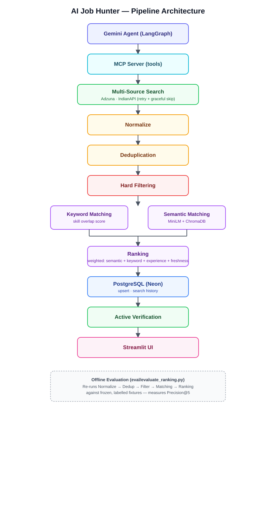

# AI Job Hunter

An agentic job-search assistant that combines a Gemini-powered LangGraph agent, an MCP tool server, and a hybrid (keyword + semantic) matching and ranking pipeline to find, score, and surface relevant job postings — with results persisted to Postgres and an offline evaluation harness to measure ranking quality.

## Architecture



The pipeline, end to end:

```
Gemini Agent (LangGraph)
        ↓
   MCP Server (tools)
        ↓
 Multi-Source Search  (Adzuna, IndianAPI — retry/backoff, graceful skip on missing keys or 429)
        ↓
    Normalize
        ↓
   Deduplication
        ↓
   Hard Filtering  (experience range, location/remote)
        ↓
 Keyword Matching  +  Semantic Matching  (MiniLM embeddings + ChromaDB)
        ↓
      Ranking  (weighted: semantic + keyword + experience fit + freshness)
        ↓
  PostgreSQL (Neon)  (upsert, search history)
        ↓
 Active Verification  (job URL still live?)
        ↓
    Streamlit UI
```

The agent (`agent_host/`) talks to the job-search logic exclusively through MCP tools (`mcp_server/`), so the LLM never touches the database, embeddings, or external APIs directly — all of that lives in `core/` and `db/`.

## Key Features

- **Multi-source ingestion** from Adzuna and IndianAPI, resilient to transient failures (timeouts, 5xx) via bounded retry/backoff, and to quota exhaustion (429) via a fast, non-retried skip — one source going down doesn't take out a search
- **Deduplication and hard filtering** on experience range and location/remote before any expensive scoring happens
- **Hybrid matching**: keyword/skill overlap scoring alongside semantic similarity (sentence-transformer embeddings compared via ChromaDB), so a job can score well even when it doesn't share exact keywords with the candidate profile
- **Weighted ranking** combining semantic score, keyword score, experience fit, and posting freshness into a single relevance score
- **Persistence** to Postgres (Neon) with upsert-based dedup across repeated searches, plus search history
- **Active-link verification** so stale job postings are flagged rather than silently surfaced
- **LangGraph agent orchestration** with a fallback path when the LLM is unavailable or returns no usable tool call
- **Offline evaluation harness** (`eval/`) measuring Precision@5 against frozen, manually labelled search results — see below
- **CI on every push/PR** running the full test suite with no external credentials required

## Offline Precision@5 Evaluation

`eval/evaluate_ranking.py` re-runs the actual matching + ranking pipeline (normalize → dedup → hard filter → keyword/experience/freshness scoring → semantic scoring → ranking) against a **frozen, manually labelled fixture** of real job postings, rather than calling the live APIs. This keeps the evaluation deterministic and runnable in CI.

**Current result:** Precision@5 = **0.40 (2/5)** on the frozen `GenAI Engineer @ Chennai` fixture (`eval/fixtures/genai_engineer_chennai.json`).

This is a result on **one fixture with a small, manually labelled ground truth** — it reflects ranking quality on that specific frozen snapshot of search results, not a general accuracy claim about the matching model. Adding more labelled fixtures across different roles/locations would give a more representative number.

To reproduce:

```bash
python -m eval.capture_fixture "GenAI Engineer" "Chennai" eval/fixtures/genai_engineer_chennai.json
python -m eval.evaluate_ranking
```

## Tech Stack

- **Agent orchestration:** LangGraph, Google Gemini (`google-genai`)
- **Tool layer:** MCP (Model Context Protocol) server
- **Matching:** sentence-transformers (`all-MiniLM-L6-v2`), ChromaDB (ephemeral, in-memory)
- **Persistence:** PostgreSQL (Neon), `psycopg`
- **UI:** Streamlit
- **Reliability:** `tenacity` (retry/backoff on external API calls)
- **Testing / CI:** `pytest`, GitHub Actions
- **Config:** `python-dotenv`

## Project Structure

```
ai-job-hunter/
├── agent_host/          # LangGraph agent (graph.py, host.py) — talks to MCP, not to core/db directly
├── core/
│   ├── sources/         # Adzuna, IndianAPI adapters + multi-source aggregator
│   ├── models/          # Job model + normalization
│   ├── dedup/           # Deduplication logic
│   ├── filtering/       # Hard filters (experience, location)
│   ├── matching/        # Keyword, semantic, experience-fit, freshness, ranking
│   ├── profile/         # Candidate profile loading
│   ├── verification/    # Active-link checking
│   └── logging_config.py
├── db/                  # Postgres connection + repository (upsert, search history)
├── mcp_server/          # MCP server exposing search_jobs / verify_job_active tools
├── ui/                  # Streamlit app
├── eval/                # Offline Precision@5 evaluation harness + fixtures + labels
├── tests/                # pytest suite
├── .github/workflows/   # CI
├── .env.example
└── requirements.txt
```

## Setup

1. **Clone and create a virtual environment**
   ```bash
   git clone <your-repo-url>
   cd ai-job-hunter
   python -m venv .venv
   .venv\Scripts\activate      # Windows
   # source .venv/bin/activate # macOS/Linux
   ```

2. **Install dependencies**
   ```bash
   pip install -r requirements.txt
   ```

3. **Configure environment variables** — copy `.env.example` to `.env` and fill in your own values:
   ```bash
   copy .env.example .env      # Windows
   # cp .env.example .env      # macOS/Linux
   ```
   The app runs with any subset of these configured — a missing key means that source (or feature) is skipped rather than the app crashing. See `.env.example` for the full list of variables the project expects (API keys, database URL, model name).

## Running

**Streamlit UI:**
```bash
streamlit run ui/app.py
```

**MCP server standalone** (for agent/tool development):
```bash
python -m mcp_server.server
```

## Testing

```bash
pytest tests/ -q
```

The suite runs fully offline by default — tests that need real credentials (database, Adzuna) are automatically skipped when those environment variables aren't set, and tests that would otherwise make a live network call are skipped in CI (see below).

## CI

Every push and pull request to `main` runs the full test suite via GitHub Actions (`.github/workflows/ci.yml`) — no API keys, database, or other secrets required. The workflow installs dependencies and runs `pytest tests/ -q` on a clean Ubuntu runner; credential-gated and network-dependent tests skip automatically in that environment.

## Screenshots

> _Add screenshots of the Streamlit UI here, e.g.:_

- `docs/screenshots/search.png` — search form and results list
- `docs/screenshots/job-detail.png` — expanded job card with match explanation
- `docs/screenshots/history.png` — search history view

```markdown


```
